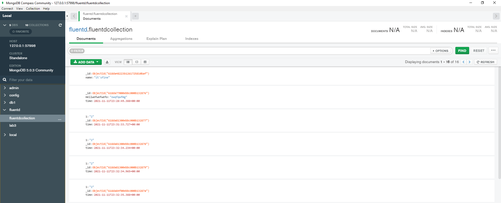

# Fluentd to mongo

In order to forward data from fluentd to mongodb we need to install mongo plugin, called: <i>fluent-plugin-mongo</i> (check Dockerfile), this is recommendet in official fluentd dockerhub: https://hub.docker.com/r/fluent/fluentd/ .

<table>

<tr>
<td> Run mongodb with mongodb-client in mongo namespace
<td>

```
cd fluentd-to-mongo/mongo
k apply -n=mongo -f .
```

```
deployment.apps/mongo-client created
deployment.apps/mongo created
service/mongo-nodeport-svc created
persistentvolume/mongo-data-pv created
persistentvolumeclaim/mongo-data created
secret/mongo-creds created
```

<tr>
<td> Add custom user & password & allow to update fluentd table
<td>

``` bash
kubectl exec -it $(kubectl get pod -l=app=mongo-client -n mongo -o custom-columns=:metadata.name)

mongosh --host mongo-nodeport-svc --port 27017 -u adminuser -p password123
```

``` bash
use fluentd
db.createCollection("fluentdcollection")
```
```json
{ ok: 1 }
```
``` bash
db.fluentdcollection.insert({name: "it'sfine" })
```

``` json
{
  acknowledged: true,
  insertedIds: { '0': ObjectId("618da48223b1261725810baf") }
}
```

```bash
db.fluentdcollection.find()
```

```json
[ { _id: ObjectId("618da48223b1261725810baf"), name: "it'sfine" } ]
```


```
db.createUser({
  user: "k8s",
  pwd: "k8s",
  roles: [
    { role: "userAdmin", db: "fluentd" },
    { role: "dbAdmin",   db: "fluentd" },
    { role: "readWrite", db: "fluentd" }
  ]
});
```

<tr>
<td>Build <br>custom <br>fluend <br>image
<td>

Dockerfile:

``` docker
FROM fluent/fluentd:latest

# Use root account to use apk
USER root

# below RUN includes plugin as examples elasticsearch is not required
# you may customize including plugins as you wish
RUN apk add --no-cache --update --virtual .build-deps \
        sudo build-base ruby-dev \
 && sudo fluent-gem install fluent-plugin-mongo -N \
 && sudo gem sources --clear-all \
 && apk del .build-deps \
 && rm -rf /tmp/* /var/tmp/* /usr/lib/ruby/gems/*/cache/*.gem

#COPY fluent.conf /fluentd/etc/
COPY entrypoint.sh /bin/

USER fluent
```

Build and push to repository

```
docker image build -t fluentd-with-mongo .
docker tag fluentd-with-mongo:latest localhost:5000/fluentd-with-mongo:latest
docker push localhost:5000/fluentd-with-mongo:latest
```


<tr>
<td>Change DaemonSet image 
<td>

``` yaml
image: localhost:5000/fluentd-with-mongo:latest
```

<tr>
<td>Rerun fluentd with new configuration
<td>

```
<match *>
	@type mongo
	host mongo-nodeport-svc.mongo  ## service name  + namespace 
	port 27017
	database fluentd
	collection fluentdcollection
	# authentication
  	user k8s
  	password k8s
	<inject>
		time_key time
	</inject>
</match>
```

```
cd fluentd-to-mongo
k create configmap fluentd-config --from-file .\fluentd-kube.conf
k apply -f .
```

<tr>
<td>Test configuration
<td>

```bash
curl -X POST -d 'json={"key":"value"}' http://fluentd-ds-pvc-svc:24220/test
```
```json
 {
    _id: ObjectId("618da8a100ebbc000b13287e"),
    key: 'value',
    time: ISODate("2021-11-11T23:34:22.002Z")
  }
```


</table>


